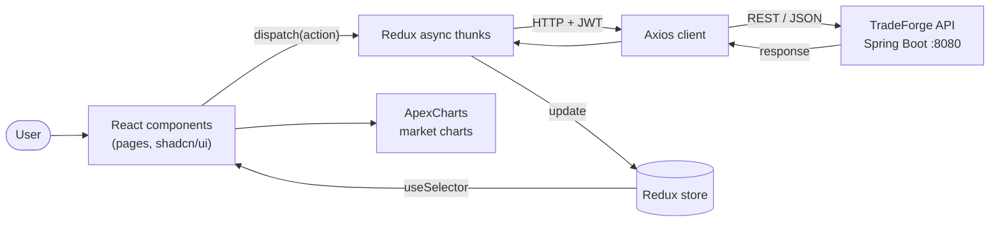

<div align="center">

# TradeForge Frontend ⚡

**The React trading terminal for the TradeForge cryptocurrency platform.**

Track live markets, place trades, manage your wallet, and top up with fiat, all from a fast, responsive single-page app.

[](https://react.dev/)
[](https://vite.dev/)
[](https://tailwindcss.com/)
[](https://redux-toolkit.js.org/)
[](https://ui.shadcn.com/)

</div>

---

## 📑 Table of Contents

- [Overview](#-overview)
- [Features](#-features)
- [Technology Stack](#-technology-stack)
- [Architecture](#-architecture)
- [Getting Started](#-getting-started)
- [Configuration](#-configuration)
- [Project Structure](#-project-structure)
- [Related Repositories](#-related-repositories)

---

## 🔭 Overview

TradeForge Frontend is the client application for the [TradeForge backend](https://github.com/Biikash1/TradeForge). It is a React single-page app that talks to the Spring Boot REST API over JSON and handles authentication (including OTP-based two-factor verification), market data visualization, trading, wallet management, and fiat deposits.

---

## 🚀 Features

| Feature | Description |
| :--- | :--- |
| **Authentication & 2FA** | Sign-up and sign-in forms with validation, plus an OTP step for accounts with Two-Factor Authentication enabled. |
| **Market Dashboard** | Live cryptocurrency prices, market cap rankings, and interactive historical price charts. |
| **Trading Terminal** | Buy and sell assets, with order history and portfolio holdings. |
| **Wallet Management** | View balances and transactions, add funds, and request withdrawals. |
| **Fiat Payments** | Deposit flows for Razorpay and Stripe, with the wallet credited after backend verification. |
| **Watchlists** | Save and follow the coins you care about. |
| **Responsive UI** | Accessible, component-driven interface that works across desktop and mobile. |

---

## 🛠️ Technology Stack

| Layer | Technologies |
| :--- | :--- |
| **Framework** | React 19, React Router 7 |
| **Build Tooling** | Vite, ESLint |
| **Styling & UI** | Tailwind CSS 4, shadcn/ui, Radix UI, Base UI, Lucide icons, `tw-animate-css`, Geist font |
| **State Management** | Redux Toolkit, React Redux, Redux Thunk |
| **Forms & Validation** | React Hook Form, Zod, `input-otp` |
| **Data & Charts** | Axios, ApexCharts (`react-apexcharts`) |
| **Notifications** | Sonner, React Toastify |

---

## 🧭 Architecture

The app follows a unidirectional data flow: UI components dispatch async actions, Redux Toolkit manages state, and a shared Axios client communicates with the backend API.



---

## 🏁 Getting Started

### Prerequisites

- Node.js 20.19+ or 22.12+ (required by Vite)
- npm 10+
- The [TradeForge backend](https://github.com/Biikash1/TradeForge) running locally (default `http://localhost:8080`)

### Installation

```bash
# 1. Clone the repository
git clone https://github.com/Biikash1/TradeForge-Frontend.git
cd TradeForge-Frontend

# 2. Install dependencies
npm install

# 3. Start the dev server
npm run dev
```

The app starts on `http://localhost:5173`.

> **Tip:** start the backend first so API calls succeed. See the [backend setup guide](https://github.com/Biikash1/TradeForge#-getting-started).

---

## ⚙️ Configuration

Vite exposes environment variables prefixed with `VITE_`. Create a `.env.local` file in the project root (it is git-ignored for secrets and local overrides):

```env
VITE_API_BASE_URL=http://localhost:8080
```

| Variable | Description | Default |
| :--- | :--- | :--- |
| `VITE_API_BASE_URL` | Base URL of the TradeForge backend API | `http://localhost:8080` |

> **Note:** only put public values here. Anything prefixed with `VITE_` is bundled into the client and visible to users, so never store secrets (payment secret keys, JWT secrets) in this app.


---

## 📁 Project Structure

```text
TradeForge-Frontend/
├── public/               # Static assets served as-is
├── src/                  # Application source (components, pages, Redux store, API client)
├── components.json       # shadcn/ui configuration
├── eslint.config.js      # ESLint configuration
├── index.html            # Vite entry HTML
├── jsconfig.json         # Path aliases and editor configuration
├── vite.config.js        # Vite configuration
├── package.json
└── README.md
```

## 🔗 Related Repositories

| Repository | Description |
| :--- | :--- |
| **[TradeForge](https://github.com/Biikash1/TradeForge)** | Spring Boot backend: REST API, JWT + 2FA security, trading engine, wallet and payments |
| **[TradeForge-Frontend](https://github.com/Biikash1/TradeForge-Frontend)** (this repo) | React trading terminal |
